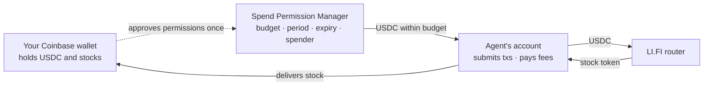

# How Mandate trades your tokenized stocks

What happens between "Buy $10 of Apple" and the shares landing in your Coinbase wallet, who is allowed to do what, and what has to change before this runs with real money at scale.

## The three parties

- **Your Coinbase wallet.** A Base Account smart wallet secured by your passkey. It holds your USDC and your stocks. It signs the USDC budget permission at setup; a chat mandate also signs each stock's sell permission the first time you sell that stock, while an automatic mandate signs them all at setup. It is never asked to sign an individual trade.
- **Your agent account** (the "spender" in code and on-chain). Every wallet gets its own, derived on the backend from a root key (`agent/data/spender.key` or `AGENT_PRIVATE_KEY`), so it is stable across restarts and nothing is stored per user. It submits your transactions, pays their network fees from its own ETH (you fund it; the app shows its address with a copy action), and holds tokens only for the seconds a swap takes. It can only move what your permission allows.
- **Base contracts.** The Spend Permission Manager (`0xf85210B21cC50302F477BA56686d2019dC9b67Ad`) enforces the budget on-chain. Chainlink feeds supply prices 24/5. LI.FI's reviewed Base router (`0x1231DEB6f5749EF6cE6943a275A1D3E7486F4EaE`) routes each swap. USDC and Coinbase's B20 stock tokens are the assets.

Sells run the same loop in reverse: the stock leaves your wallet under its sell permission, is swapped to USDC, and the USDC is delivered back. Under a chat mandate, the first sell of a stock is preceded by one wallet prompt for that stock's sell permission, which the agent registers on Base before the order is queued.

## Setting up a mandate, once

You choose the budget and period, the allowed stocks, a risk preset (position cap, take-profit, stop-loss), the expiry (7, 30 or 90 days) and who starts trades (you in chat, or the agent automatically). Coinbase's wallet signs one permission per prompt and rejects combined approvals (builds 6 through 8 tried), so the number of prompts depends on who starts trades:

- **Confirm in chat:** one prompt at setup, for the USDC budget. The first time you sell a stock, the review sheet says "Approve and confirm": Coinbase asks once for that stock's sell permission, the agent registers it on Base, and the order is placed. Later sells of that stock do not ask again.
- **Automatic:** USDC plus one prompt per stock at setup, because the agent must be able to exit positions while you are away. The review shows token names and progress; retries keep received signatures while the unchanged draft remains open, and a save retry does not request signatures again.

The backend stores the signed mandate as *pending*. On the first run it registers any missing token permissions through `approveWithSignature`, then activates the mandate. Sell permissions added later by a chat mandate are registered the moment they arrive. Existing combined-signature records remain compatible with the backend contract path. The wallet is not asked to approve individual trades within the mandate.

> The stock permissions are large allowances. On-chain they let the agent pull any amount of that token you hold; per-position limits are enforced by the backend, not the contract. The review sheet says so before you sign.

## A buy, step by step (chat path)

1. **Proposal.** The model turns the request into a structured trade. The backend checks: allowed stock, remaining budget this period, position cap, and a Chainlink price fresher than 26 hours.
2. **Your confirmation.** The sheet shows amount, reference price and budget after the trade. Confirming queues an order for 60 seconds (cancellable). A price drift over 1% since the proposal refuses the order.
3. **Pull USDC** *(transaction)*. `spend` on the Spend Permission Manager moves the USDC from your wallet to the agent's account, only if it is inside the signed budget and period.
4. **Swap** *(transaction)*. A fresh LI.FI quote is validated (Base only, reviewed router, ≤1% slippage), then approved and executed.
5. **Deliver** *(transaction)*. The stock tokens are transferred to your wallet; the position and the budget used are recorded.

Each hash is journaled before broadcast, so a crash cannot hide a submitted step. A reverted or unknown step marks the mandate *needs review* and stops it.

**Automatic mandates** run every 30 minutes: skip if the market is closed; deterministic risk exits (take-profit/stop-loss) first; then the model's JSON decision, validated by the same guardrails before an order is queued. Model errors fail the cycle; they never fall back to a guess.

## Who enforces what

| The contract (regardless of the backend) | The backend (its own checks) |
| --- | --- |
| Only the named agent address can spend | Which stocks, position caps, take-profit and stop-loss |
| At most the budget per period, tracked on-chain | Price freshness, 1% drift, reviewed router, 1% slippage |
| Nothing after expiry | Simulation and live records stamped and never mixed |
| Revocable by you any time (app or account.base.app) | Partial executions halt the mandate for review |

The chain caps *how much*; the backend decides *what and when*. A compromised backend could misuse the allowances you granted. The contract bounds spending by token, amount, period and expiry; it does not enforce the intended swap route or return destination. Large stock sell allowances are an additional trust boundary. Revoke permissions if you no longer trust the operator.

## Simulation, live, and the $1 test

The backend runs in one mode at a time; every mandate is stamped with the mode it was created in. Switching never signs anything; a simulation mandate stays simulated. "Swap $1 with your wallet" (Settings → Live trading) builds a real LI.FI route from your own address, shows exactly what will be signed, and lets your wallet send it: it proves the route validation and the wallet round trip without involving the agent's account.

## What production needs

| Area | Today | For production |
| --- | --- | --- |
| Fees for the agent | Manual ETH top-up | Paymaster-sponsored gas (smart-account agent) or an ETH permission for self top-up; low-balance alerts |
| Key custody | Cloudflare Worker secret; local file in Node development | HSM / cloud KMS signer; small hot balance; rotation runbook |
| Hosting | Cloudflare Workers, SQLite Durable Object, persistent sessions and alarms | Scale testing, recovery drills and per-wallet partitioning when needed |
| Mode control | Operator-restricted in the hosted deployment | Pin per environment (`DRY_RUN=0`, `LOCK_MODE=1`); operator-only switching |
| Reconciliation | Journal + console logs | Alerts on failed/partial executions; a job resolving "prepared" steps against Base; manual-review runbook |
| Model costs | Daily token budgets and cooldowns (done) | Provider spend cap; per-mandate cost reporting |
| Price safety | 26h staleness, 1% drift, 1% slippage (done) | Circuit breaker on abnormal feed moves |
| Compliance | Non-US disclaimer | Organization developer account (App Store 3.1.5), storefront restriction, written disclosures |
| Rollout | Simulation + $1 wallet swap (done) | First live mandates with tiny budgets and short expiries, then widen |

None of these change the trading mechanism; they change where the backend runs, who holds its key, and how you learn when something goes wrong.
